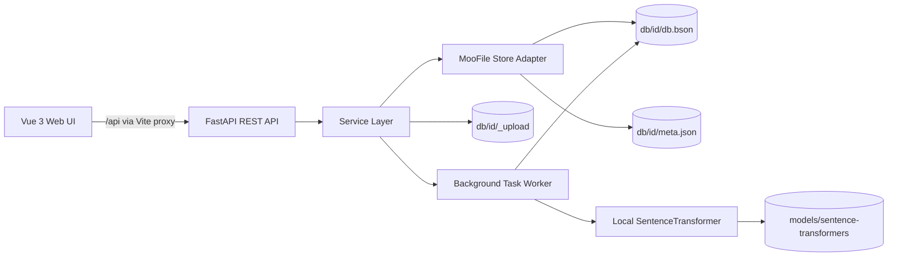

# MooFile RAG Base

MooFile RAG Base is a local-first database management and retrieval application. It combines a JSON document database, a vector knowledge base, offline multilingual embeddings, and a browser-based administration interface in one repository.

The project is intended for local development, evaluation, and small self-hosted deployments. Data, uploaded source files, task history, and vector embeddings remain on the local machine.

## Highlights

- Manage regular JSON databases and vector knowledge bases.
- Store data in local MooFile BSON collections without an external database server.
- Upload, download, list, and delete knowledge-base documents.
- Split documents and generate embeddings with a local SentenceTransformer model.
- Run semantic retrieval with score threshold filtering.
- Browse, search, filter, edit, batch-delete, and export JSON records.
- Track vectorization and index tasks, including progress, logs, cancellation, and retry.
- View database statistics, storage usage, and document status distributions.
- Soft-delete databases to a trash area, then restore or permanently remove them.
- Use the interface in English, Chinese, or Japanese. Browser language is used by default; a saved user choice takes precedence.
- Operate entirely through a responsive Vue administration interface or the REST API.

## Technology Stack

| Layer | Technology |
| --- | --- |
| Backend | Python 3.12, FastAPI, Uvicorn, Pydantic |
| Storage | MooFile 1.2.4, BSON files, JSON metadata |
| Embeddings | Sentence Transformers 6.0.1, local multilingual models |
| Document processing | LangChain, langchain-text-splitters, Unstructured |
| Frontend | Vue 3.5, TypeScript 5.7, Vite 6 |
| UI and charts | Naive UI, Ionicons, Apache ECharts |
| Localization | vue-i18n 9.14 |

## Architecture



The backend follows a router-service-store structure:

1. FastAPI routers validate HTTP input and return a common response envelope.
2. Services implement database, record, document, task, retrieval, and statistics behavior.
3. The store layer opens a MooFile collection for each database and manages its metadata.
4. A daemon worker processes pending vectorization and index tasks inside the backend process.
5. The frontend calls `/api`; during development, Vite proxies those requests to `http://127.0.0.1:8888`.

### Local data model

Each logical database is a directory under `db/`:

```text
db/
`-- <db_id>/
    |-- db.bson                 # Records, document metadata, chunks, and tasks
    |-- db.bson.meta            # MooFile internal metadata, when generated
    |-- meta.json               # Database metadata and vectorConfig
    `-- _upload/                # Original uploaded files
```

Records inside `db.bson` are distinguished by `recordType`:

- `record`: a regular JSON row or a vector chunk.
- `doc`: uploaded document metadata.
- `task`: background task state and logs.

## Implemented Features

### Database management

- Create regular JSON databases and vector knowledge bases.
- Database names are 2–64 English letters, digits, or underscores.
- List databases with record/document counts, field counts, size, and update time.
- Rename and soft-delete databases.
- Restore databases from trash, permanently delete them, or empty the trash.
- Report total local storage usage against a configurable quota.

### Regular JSON data

- Add and edit arbitrary JSON objects.
- Paginate records and aggregate available field names.
- Search record content.
- Build `AND` or `OR` filter groups with equality, comparison, existence, substring, regular-expression, and array operators.
- Select and batch-delete records.
- Switch between table and JSON views.
- Export the current page or all records as JSON.

### Vector knowledge bases

- Upload files up to 50 MB and retain the original source file locally.
- Configure the embedding model, chunk size, overlap, Top K, and similarity threshold in the vector database Settings tab.
- Start vectorization explicitly after upload.
- Generate embeddings with a local model and save them alongside chunks.
- List and inspect chunks, re-embed a chunk, and delete chunks.
- Perform semantic retrieval using the database's embedding model and filter results by similarity threshold.
- Download the original uploaded document.
- Discover local embedding models and request an index rebuild after changing models.

### Tasks and observability

- Persist task state in the corresponding database.
- Display pending, running, completed, failed, and cancelled states.
- Show progress and task logs.
- Cancel active tasks and retry failed or cancelled tasks.
- Display database statistics, seven-day trends, status distributions, and failure counts.
- Expose health, model, and storage endpoints.

### User interface

- Responsive database sidebar and route-based database views.
- Confirmation prompts for document, record, and batch deletion; lists and statistics refresh after mutations.
- English, Simplified Chinese, and Japanese translations.
- Locale selection priority: saved user preference, then browser language, then English.
- Locale-aware dates, relative times, and number formatting.
- Header help renders the matching English, Chinese, or Japanese README as Markdown.

## Repository Structure

```text
.
|-- app.py                       # FastAPI application and process entry point
|-- requirements.txt            # Python dependencies
|-- api/
|   |-- config.py               # Paths, server settings, model, upload limits
|   |-- schemas.py              # API request/response schemas
|   |-- store.py                # MooFile collection and metadata access
|   |-- routers/                # REST endpoints
|   `-- services/               # Business logic and background task worker
|-- utils/
|   |-- moofile_util.py         # Lower-level MooFile utility facade
|   |-- document_loader.py      # LangChain document loaders and splitters
|   `-- vector_util.py          # Vector helper utilities
|-- models/sentence-transformers/ # Local embedding and reranker models
|-- db/                         # Runtime databases and uploaded source files
|-- data/                       # Sample source data
|-- sample/                     # MooFile table and vector examples
|-- tests/                      # Unit, CRUD, API, and report artifacts
|-- docs/                       # API, backend, and UI design documentation
`-- web/
    |-- public/locales/         # en, zh, and ja translation dictionaries
    |-- src/                    # Vue application source
    |-- package.json
    `-- vite.config.ts
```

## Prerequisites

- Python 3.12
- Node.js 20 LTS or newer
- npm
- Sufficient disk space for Python packages, local models, uploads, and generated embeddings

No external database or hosted embedding API is required. The repository already contains local models under `models/sentence-transformers/`. If those model directories are omitted from a distribution, restore them before starting the backend or update `MODEL_PATH` in `api/config.py`.

## Development Setup

### 1. Create the Python environment

From the repository root:

**Windows PowerShell**

```powershell
python -m venv .venv
.\.venv\Scripts\Activate.ps1
python -m pip install --upgrade pip
pip install -r requirements.txt
```

**macOS or Linux**

```bash
python3.12 -m venv .venv
source .venv/bin/activate
python -m pip install --upgrade pip
pip install -r requirements.txt
```

Some `unstructured` document loaders may require optional system packages for specific office or image formats. The core text-based workflow does not require an external service.

### 2. Start the backend

```powershell
python app.py
```

The API listens on `http://127.0.0.1:8888`.

- Interactive API documentation: `http://127.0.0.1:8888/docs`
- OpenAPI schema: `http://127.0.0.1:8888/openapi.json`
- Health endpoint: `http://127.0.0.1:8888/api/system/health`

Embedding models load lazily on the first vectorization or retrieval request. The first vector operation can therefore take longer, especially without model files in the operating-system cache.

### 3. Install and start the frontend

In a second terminal:

```powershell
cd web
npm install
npm run dev
```

Open the URL printed by Vite, normally `http://127.0.0.1:5173`. Keep the backend running because the development server proxies `/api` to port `8888`.

## Production Frontend Build

```powershell
cd web
npm run build
npm run preview
```

The production assets are written to `web/dist/`. The FastAPI application does not currently serve that directory, so a deployed installation must serve `web/dist/` with a web server and proxy `/api` to the backend, or add explicit static-file hosting to FastAPI.

## Configuration

Runtime settings are currently defined in `api/config.py`:

| Setting | Default | Purpose |
| --- | --- | --- |
| `HOST` | `127.0.0.1` | Backend bind address |
| `PORT` | `8888` | Backend port |
| `DB_DIR` | `<repo>/db` | Database root |
| `LEGACY_UPLOAD_DIR` | `<repo>/db/_uploads` | Compatibility path for databases created before per-database uploads |
| `MODEL_PATH` | `paraphrase-multilingual-MiniLM-L12-v2` | Default local embedding model |
| `EMBEDDING_DIMS` | `384` | Default embedding dimensions |
| `DEFAULT_CHUNK_SIZE` | `500` | Default chunk length in characters |
| `DEFAULT_OVERLAP` | `20` | Default overlap in characters |
| `DEFAULT_TOP_K` | `10` | Default retrieval result count |
| `DEFAULT_SIMILARITY_THRESHOLD` | `0.3` | Default retrieval score threshold |
| `MAX_UPLOAD_MB` | `50` | Per-file upload limit |
| `STORAGE_QUOTA_GB` | `5.0` | Quota used by the storage status API |

These values are Python constants rather than environment variables. Change the file or add an environment-backed configuration layer for deployment-specific settings.

## API Overview

All application endpoints use a common response shape:

```json
{
  "code": 0,
  "data": {},
  "message": "ok"
}
```

Main endpoint groups:

| Prefix | Responsibility |
| --- | --- |
| `/api/databases` | Database creation, listing, details, rename, and soft deletion |
| `/api/databases/{id}/vector-config` | Read and update database-level vector defaults |
| `/api/trash` | Restore and permanent deletion |
| `/api/databases/{id}/records` | JSON record CRUD, fields, search, filters, and pagination |
| `/api/databases/{id}/documents` | Upload, list, download, delete, and vectorize documents |
| `/api/databases/{id}/chunks` | List, re-embed, and delete chunks |
| `/api/databases/{id}/retrieval` | Semantic retrieval |
| `/api/databases/{id}/stats` | Database statistics |
| `/api/tasks` | Task listing, cancellation, retry, and logs |
| `/api/system` | Health, storage, available local models, and localized help Markdown |

See `docs/api_design.md` or the live Swagger UI for request and response details.

## Testing and Validation

Run utility unit tests from the repository root:

```powershell
python -m unittest tests.test_moofile_util
```

Run the broader API test with the backend already running:

```powershell
python tests/run_api_test.py
```

Additional focused scripts are available:

```powershell
python tests/run_table_crud_test.py
python tests/run_vector_crud_test.py
```

Validate the frontend:

```powershell
cd web
npx vue-tsc --noEmit
npm run build
```

The API test creates and modifies test databases. Back up `db/` before running tests against an environment containing important data.

## Backup and Data Safety

- Stop the backend before taking a consistent filesystem backup.
- Back up the complete `db/` directory. Each database now carries its original files in its own `_upload/` directory.
- Keep each database directory intact; `db.bson`, its metadata, `meta.json`, and `_upload/` belong together.
- A normal delete moves a database to trash. Permanent deletion removes its database directory and cannot be undone.
- Do not edit BSON files manually while the backend is running.

## Current Limitations

- The application has no authentication or authorization layer.
- CORS currently allows every origin, although the backend binds to localhost by default.
- Background tasks run in one in-process daemon thread; they are not distributed and do not survive a process shutdown while running.
- Backend configuration is file-based rather than environment-based.
- FastAPI does not serve the built frontend automatically.
- The upload API accepts PDF, Word, PowerPoint, Excel, text, Markdown, CSV, and HTML extensions. However, the active background vectorization worker currently reads plain text, Markdown, CSV, and HTML directly. Other accepted formats may upload successfully but fail during vectorization until the worker is connected to the richer loaders in `utils/document_loader.py`.
- Changing a database's embedding model clears incompatible vectors and requires its documents to be vectorized again.

These defaults make the project suitable for trusted local use. Add authentication, restrictive CORS rules, durable task execution, environment-based secrets/configuration, TLS, and a production reverse proxy before exposing it to an untrusted network.

## Troubleshooting

### The first vector operation is slow

Embedding models are loaded on demand. If loading fails, verify that the model selected in the database Settings tab exists under `models/sentence-transformers/` and is a valid SentenceTransformer model.

### Frontend requests fail

Confirm that:

1. The backend is running on `127.0.0.1:8888`.
2. The frontend was started from `web/` with `npm run dev`.
3. Nothing else changed the `/api` proxy target in `web/vite.config.ts`.

### A document uploads but vectorization fails

Check the task log in the UI. For the current worker implementation, prefer UTF-8 TXT, Markdown, CSV, or HTML sources. Also verify that overlap is smaller than chunk size.

### PowerShell blocks virtual-environment activation

For the current shell only, an appropriate local execution policy may be required:

```powershell
Set-ExecutionPolicy -Scope Process -ExecutionPolicy Bypass
.\.venv\Scripts\Activate.ps1
```

## Additional Documentation

- `docs/api_design.md`: backend API and data model
- `docs/moofile-database-management-design.md`: database management design
- `docs/ui-design.md`: user-interface design
- `tests/api_test_report.md`: API test report
- `tests/ui_test_report.md`: UI test report

## License

No license file is currently included in this repository. Add one before redistributing the project or accepting external contributions.
