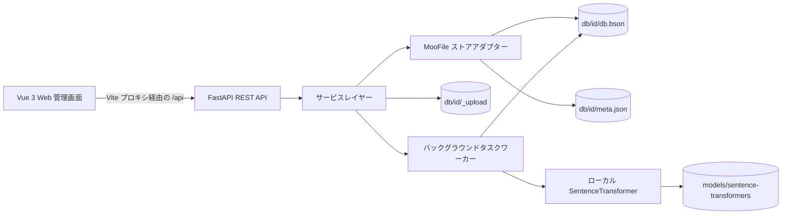

# MooFile RAG Base

MooFile RAG Base は、ローカルファーストのデータベース管理・検索アプリケーションです。JSON ドキュメントデータベース、ベクトルナレッジベース、オフライン多言語埋め込みモデル、ブラウザベースの管理画面を1つのリポジトリに統合しています。

本プロジェクトは、ローカル開発、機能評価、小規模なセルフホスティング環境を対象としています。データ、アップロードされた原本ファイル、タスク履歴、ベクトル埋め込みはすべてローカルマシン上に保持されます。

## 主な特長

- 通常の JSON データベースとベクトルナレッジベースを管理できます。
- 外部データベースサーバーを使用せず、ローカルの MooFile BSON コレクションにデータを保存します。
- ナレッジベース文書のアップロード、ダウンロード、一覧表示、削除ができます。
- ローカルの SentenceTransformer モデルで文書を分割し、埋め込みベクトルを生成します。
- 類似度しきい値による絞り込み付きのセマンティック検索を実行できます。
- JSON レコードの閲覧、検索、絞り込み、編集、一括削除、エクスポートができます。
- ベクトル化・インデックスタスクの進捗、ログ、キャンセル、再試行を管理できます。
- データベース統計、ストレージ使用量、文書ステータス分布を確認できます。
- データベースをゴミ箱へ論理削除し、後から復元または完全削除できます。
- 英語、中国語、日本語の UI を利用できます。初期状態ではブラウザ言語を使用し、ユーザーが保存した選択を優先します。
- レスポンシブな Vue 管理画面または REST API からすべての操作を行えます。

## 技術スタック

| レイヤー | 技術 |
| --- | --- |
| バックエンド | Python 3.12、FastAPI、Uvicorn、Pydantic |
| ストレージ | MooFile 1.2.4、BSON ファイル、JSON メタデータ |
| 埋め込み | Sentence Transformers 6.0.1、ローカル多言語モデル |
| 文書処理 | LangChain、langchain-text-splitters、Unstructured |
| フロントエンド | Vue 3.5、TypeScript 5.7、Vite 6 |
| UI・チャート | Naive UI、Ionicons、Apache ECharts |
| 国際化 | vue-i18n 9.14 |

## システムアーキテクチャ



バックエンドは、ルーター、サービス、ストアの3層構成です。

1. FastAPI ルーターが HTTP 入力を検証し、共通レスポンス形式で返します。
2. サービスレイヤーがデータベース、レコード、文書、タスク、検索、統計の処理を実装します。
3. ストアレイヤーがデータベースごとの MooFile コレクションを開き、メタデータを管理します。
4. バックエンドプロセス内のデーモンワーカーが、保留中のベクトル化・インデックスタスクを処理します。
5. フロントエンドは `/api` を呼び出します。開発環境では Vite がリクエストを `http://127.0.0.1:8888` へプロキシします。

### ローカルデータモデル

各論理データベースは `db/` 配下のディレクトリに対応します。

```text
db/
`-- <db_id>/
    |-- db.bson                 # レコード、文書メタデータ、チャンク、タスク
    |-- db.bson.meta            # MooFile 内部メタデータ（必要に応じて生成）
    |-- meta.json               # データベースメタデータと vectorConfig
    `-- _upload/                # アップロードされた原本ファイル
```

`db.bson` 内のレコードは `recordType` で区別されます。

- `record`: 通常の JSON 行またはベクトルチャンク。
- `doc`: アップロード文書のメタデータ。
- `task`: バックグラウンドタスクの状態とログ。

## 実装済み機能

### データベース管理

- 通常の JSON データベースとベクトルナレッジベースを作成。
- データベース名は2～64文字の英字、数字、アンダースコアのみ使用可能。
- レコード数、文書数、フィールド数、サイズ、更新日時を含むデータベース一覧を表示。
- データベース名の変更と論理削除。
- ゴミ箱からの復元、完全削除、ゴミ箱の一括消去。
- 設定可能なクォータに対するローカルストレージ使用量の表示。

### 通常の JSON データ

- 任意の JSON オブジェクトを追加・編集。
- レコードのページネーションと利用可能なフィールド名の集計。
- レコード内容の検索。
- 等価、比較、存在確認、部分文字列、正規表現、配列演算子を用いた `AND` / `OR` 条件グループの作成。
- レコードの選択と一括削除。
- テーブル表示と JSON 表示の切り替え。
- 現在のページまたは全レコードを JSON としてエクスポート。

### ベクトルナレッジベース

- 最大 50 MB のファイルをアップロードし、原本をローカルに保存。
- ベクトルデータベースの「設定」タブで、埋め込みモデル、チャンクサイズ、オーバーラップ、Top K、類似度しきい値を設定。
- アップロード後、ユーザー操作で明示的にベクトル化を開始。
- ローカルモデルで埋め込みを生成し、チャンクとともに保存。
- チャンクの一覧・詳細表示、個別再埋め込み、削除。
- データベースに設定された埋め込みモデルでセマンティック検索を行い、類似度しきい値で結果を絞り込み。
- アップロードした原本文書のダウンロード。
- ローカル埋め込みモデルの検出と、モデル変更後のインデックス再構築要求。

### タスクと可観測性

- タスク状態を対応するデータベースへ永続化。
- 保留中、実行中、完了、失敗、キャンセル済みの状態を表示。
- 進捗とタスクログを表示。
- 実行中タスクのキャンセル、失敗・キャンセル済みタスクの再試行。
- データベース統計、7日間の推移、ステータス分布、失敗件数を表示。
- ヘルスチェック、モデル一覧、ストレージ状態のエンドポイントを提供。

### ユーザーインターフェース

- レスポンシブなデータベースサイドバーとルーティングベースのデータベース画面。
- 文書、レコード、一括削除には確認を表示し、変更後に一覧と統計を自動更新。
- 英語、簡体字中国語、日本語に対応。
- 言語選択の優先順位は、保存済みユーザー設定、ブラウザ言語、英語の順です。
- 日付、相対時刻、数値を選択中の言語に合わせて表示。
- Header のヘルプボタンで、現在の言語に対応する英語・中国語・日本語 README を Markdown 表示。

## リポジトリ構成

```text
.
|-- app.py                       # FastAPI アプリケーションとプロセスのエントリーポイント
|-- requirements.txt            # Python 依存関係
|-- api/
|   |-- config.py               # パス、サーバー、モデル、アップロード制限の設定
|   |-- schemas.py              # API リクエスト・レスポンスモデル
|   |-- store.py                # MooFile コレクションとメタデータへのアクセス
|   |-- routers/                # REST エンドポイント
|   `-- services/               # ビジネスロジックとバックグラウンドタスクワーカー
|-- utils/
|   |-- moofile_util.py         # 低レベル MooFile ユーティリティ
|   |-- document_loader.py      # LangChain 文書ローダーと分割処理
|   `-- vector_util.py          # ベクトル関連ユーティリティ
|-- models/sentence-transformers/ # ローカル埋め込み・リランキングモデル
|-- db/                         # 実行時データベースとアップロード原本
|-- data/                       # サンプルデータ
|-- sample/                     # MooFile テーブル・ベクトルサンプル
|-- tests/                      # 単体、CRUD、API テストとレポート
|-- docs/                       # API、バックエンド、UI 設計資料
`-- web/
    |-- public/locales/         # 英語、中国語、日本語の翻訳辞書
    |-- src/                    # Vue アプリケーションのソース
    |-- package.json
    `-- vite.config.ts
```

## 前提条件

- Python 3.12
- Node.js 20 LTS 以降
- npm
- Python パッケージ、ローカルモデル、アップロード、生成された埋め込みを保存できる十分なディスク容量

外部データベースやホスティング型埋め込み API は不要です。リポジトリには `models/sentence-transformers/` 配下にローカルモデルが含まれています。配布物にモデルディレクトリが含まれていない場合は、バックエンド起動前に復元するか、`api/config.py` の `MODEL_PATH` を変更してください。

## 開発環境の構築

### 1. Python 環境の作成

リポジトリのルートで実行します。

**Windows PowerShell**

```powershell
python -m venv .venv
.\.venv\Scripts\Activate.ps1
python -m pip install --upgrade pip
pip install -r requirements.txt
```

**macOS または Linux**

```bash
python3.12 -m venv .venv
source .venv/bin/activate
python -m pip install --upgrade pip
pip install -r requirements.txt
```

一部の `unstructured` 文書ローダーでは、特定の Office 文書や画像形式を処理するために追加のシステムパッケージが必要になる場合があります。基本的なテキスト処理は外部サービスを必要としません。

### 2. バックエンドの起動

```powershell
python app.py
```

API は `http://127.0.0.1:8888` で待ち受けます。

- 対話型 API ドキュメント: `http://127.0.0.1:8888/docs`
- OpenAPI スキーマ: `http://127.0.0.1:8888/openapi.json`
- ヘルスチェック: `http://127.0.0.1:8888/api/system/health`

埋め込みモデルは、最初のベクトル化または検索時にオンデマンドで読み込まれます。そのため、特にモデルファイルが OS キャッシュにない場合、最初のベクトル操作に時間がかかることがあります。

### 3. フロントエンドのインストールと起動

別のターミナルで実行します。

```powershell
cd web
npm install
npm run dev
```

Vite が表示する URL（通常は `http://127.0.0.1:5173`）を開きます。開発サーバーが `/api` をポート `8888` へプロキシするため、バックエンドは起動したままにしてください。

## 本番用フロントエンドのビルド

```powershell
cd web
npm run build
npm run preview
```

本番用アセットは `web/dist/` に出力されます。現在の FastAPI アプリケーションはこのディレクトリを配信しません。デプロイ時は Web サーバーで `web/dist/` を配信して `/api` をバックエンドへプロキシするか、FastAPI に静的ファイル配信を追加してください。

## 設定

実行時設定は現在 `api/config.py` に定義されています。

| 設定 | デフォルト値 | 用途 |
| --- | --- | --- |
| `HOST` | `127.0.0.1` | バックエンドのバインドアドレス |
| `PORT` | `8888` | バックエンドのポート |
| `DB_DIR` | `<repo>/db` | データベースのルート |
| `LEGACY_UPLOAD_DIR` | `<repo>/db/_uploads` | データベース別保存へ移行する前の旧アップロード先との互換用 |
| `MODEL_PATH` | `paraphrase-multilingual-MiniLM-L12-v2` | デフォルトのローカル埋め込みモデル |
| `EMBEDDING_DIMS` | `384` | デフォルトの埋め込み次元数 |
| `DEFAULT_CHUNK_SIZE` | `500` | デフォルトのチャンク文字数 |
| `DEFAULT_OVERLAP` | `20` | デフォルトのオーバーラップ文字数 |
| `DEFAULT_TOP_K` | `10` | デフォルトの検索結果件数 |
| `DEFAULT_SIMILARITY_THRESHOLD` | `0.3` | デフォルトの類似度しきい値 |
| `MAX_UPLOAD_MB` | `50` | 1ファイルあたりのアップロード上限 |
| `STORAGE_QUOTA_GB` | `5.0` | ストレージ状態 API が使用するクォータ |

これらは環境変数ではなく Python 定数です。デプロイ環境ごとにファイルを変更するか、環境変数ベースの設定レイヤーを追加してください。

## API 概要

すべてのアプリケーションエンドポイントは共通レスポンス形式を使用します。

```json
{
  "code": 0,
  "data": {},
  "message": "ok"
}
```

主なエンドポイントグループ：

| プレフィックス | 役割 |
| --- | --- |
| `/api/databases` | データベースの作成、一覧、詳細、名前変更、論理削除 |
| `/api/databases/{id}/vector-config` | データベース単位のベクトル既定値の取得と更新 |
| `/api/trash` | 復元と完全削除 |
| `/api/databases/{id}/records` | JSON レコードの CRUD、フィールド、検索、絞り込み、ページネーション |
| `/api/databases/{id}/documents` | 文書のアップロード、一覧、ダウンロード、削除、ベクトル化 |
| `/api/databases/{id}/chunks` | チャンクの一覧、再埋め込み、削除 |
| `/api/databases/{id}/retrieval` | セマンティック検索 |
| `/api/databases/{id}/stats` | データベース統計 |
| `/api/tasks` | タスクの一覧、キャンセル、再試行、ログ |
| `/api/system` | ヘルスチェック、ストレージ、ローカルモデル、多言語ヘルプ Markdown |

リクエストとレスポンスの詳細は `docs/api_design.md` または実行中の Swagger UI を参照してください。

## テストと検証

リポジトリのルートでユーティリティ単体テストを実行します。

```powershell
python -m unittest tests.test_moofile_util
```

バックエンドを起動した状態で、より広範な API テストを実行します。

```powershell
python tests/run_api_test.py
```

追加の機能別スクリプトも利用できます。

```powershell
python tests/run_table_crud_test.py
python tests/run_vector_crud_test.py
```

フロントエンドを検証します。

```powershell
cd web
npx vue-tsc --noEmit
npm run build
```

API テストはテスト用データベースを作成・変更します。重要なデータがある環境で実行する前に `db/` をバックアップしてください。

## バックアップとデータ保護

- ファイルシステムの整合性を保ったバックアップを取得する前に、バックエンドを停止してください。
- `db/` ディレクトリ全体をバックアップしてください。原本ファイルは各データベース内の `_upload/` に保存されます。
- 各データベースディレクトリを一式で保持してください。`db.bson`、そのメタデータ、`meta.json`、`_upload/` はセットです。
- 通常の削除ではデータベースがゴミ箱へ移動します。完全削除ではディレクトリが削除され、元に戻せません。
- バックエンドの実行中に BSON ファイルを手動編集しないでください。

## 現在の制限事項

- 認証・認可機能は実装されていません。
- バックエンドはデフォルトでローカルホストにバインドされますが、CORS は現在すべてのオリジンを許可しています。
- バックグラウンドタスクは単一プロセス内のデーモンスレッドで実行されます。分散処理には対応しておらず、処理中にプロセスを停止するとタスクは継続されません。
- バックエンド設定は環境変数ではなくファイルベースです。
- FastAPI はビルド済みフロントエンドを自動配信しません。
- アップロード API は PDF、Word、PowerPoint、Excel、テキスト、Markdown、CSV、HTML の拡張子を受け付けます。ただし、現在のバックグラウンドベクトル化ワーカーが直接読み込めるのはプレーンテキスト、Markdown、CSV、HTML です。`utils/document_loader.py` の高機能ローダーがワーカーに接続されるまでは、その他の形式はアップロードに成功してもベクトル化に失敗する場合があります。
- データベースの埋め込みモデルを変更すると、互換性のない既存ベクトルが削除され、文書の再ベクトル化が必要になります。

これらの初期設定は、信頼できるローカル環境での利用を想定しています。信頼できないネットワークへ公開する前に、認証、厳格な CORS 設定、永続的なタスク実行、環境変数ベースのシークレット・設定管理、TLS、本番用リバースプロキシを追加してください。

## トラブルシューティング

### 最初のベクトル操作が遅い

埋め込みモデルはオンデマンドで読み込まれます。読み込みに失敗する場合は、データベースの「設定」タブで選択したモデルが `models/sentence-transformers/` に存在し、有効な SentenceTransformer モデルであることを確認してください。

### フロントエンドのリクエストが失敗する

以下を確認してください。

1. バックエンドが `127.0.0.1:8888` で実行されていること。
2. `web/` ディレクトリで `npm run dev` を実行してフロントエンドを起動したこと。
3. `web/vite.config.ts` の `/api` プロキシ先が変更されていないこと。

### 文書のアップロード後にベクトル化が失敗する

UI のタスクログを確認してください。現在のワーカー実装では、UTF-8 の TXT、Markdown、CSV、HTML を推奨します。また、オーバーラップがチャンクサイズより小さいことを確認してください。

### PowerShell が仮想環境の有効化をブロックする

現在のシェルだけに適切な実行ポリシーを設定できます。

```powershell
Set-ExecutionPolicy -Scope Process -ExecutionPolicy Bypass
.\.venv\Scripts\Activate.ps1
```

## その他のドキュメント

- `docs/api_design.md`: バックエンド API とデータモデル
- `docs/moofile-database-management-design.md`: データベース管理設計
- `docs/ui-design.md`: ユーザーインターフェース設計
- `tests/api_test_report.md`: API テストレポート
- `tests/ui_test_report.md`: UI テストレポート

## ライセンス

現在、このリポジトリにはライセンスファイルが含まれていません。プロジェクトを再配布したり、外部からのコントリビューションを受け入れたりする前に、ライセンスを追加してください。
