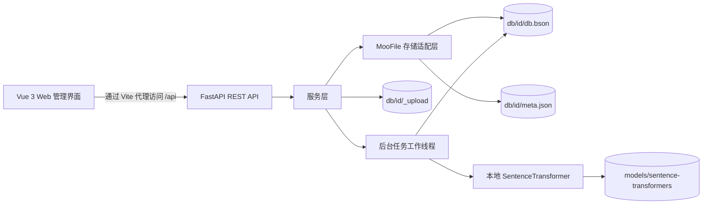

# MooFile RAG Base

MooFile RAG Base 是一个本地优先的数据库管理与检索应用。它在同一仓库中整合了 JSON 文档数据库、向量知识库、离线多语言嵌入模型以及基于浏览器的管理界面。

本项目适用于本地开发、功能评估和小规模自托管部署。数据、上传的源文件、任务历史与向量嵌入均保留在本地计算机上。

## 主要特性

- 管理普通 JSON 数据库与向量知识库。
- 使用本地 MooFile BSON 集合存储数据，无需外部数据库服务器。
- 上传、下载、列出和删除知识库文档。
- 使用本地 SentenceTransformer 模型切分文档并生成嵌入向量。
- 执行语义检索，并通过相似度阈值筛选结果。
- 浏览、搜索、筛选、编辑、批量删除和导出 JSON 记录。
- 跟踪向量化和索引任务，包括进度、日志、取消与重试。
- 查看数据库统计、存储用量与文档状态分布。
- 将数据库软删除至回收站，之后可恢复或永久删除。
- 界面支持英文、中文和日文。默认使用浏览器语言，用户保存的语言选择具有更高优先级。
- 可通过响应式 Vue 管理界面或 REST API 完成全部操作。

## 技术栈

| 层级 | 技术 |
| --- | --- |
| 后端 | Python 3.12、FastAPI、Uvicorn、Pydantic |
| 存储 | MooFile 1.2.4、BSON 文件、JSON 元数据 |
| 嵌入模型 | Sentence Transformers 6.0.1、本地多语言模型 |
| 文档处理 | LangChain、langchain-text-splitters、Unstructured |
| 前端 | Vue 3.5、TypeScript 5.7、Vite 6 |
| UI 与图表 | Naive UI、Ionicons、Apache ECharts |
| 国际化 | vue-i18n 9.14 |

## 系统架构



后端采用路由、服务与存储三层结构：

1. FastAPI 路由负责验证 HTTP 输入并返回统一响应结构。
2. 服务层实现数据库、记录、文档、任务、检索和统计业务。
3. 存储层为每个数据库打开对应的 MooFile 集合并管理其元数据。
4. 后端进程内的守护工作线程处理待执行的向量化与索引任务。
5. 前端调用 `/api`；开发环境中，Vite 将请求代理至 `http://127.0.0.1:8888`。

### 本地数据模型

每个逻辑数据库对应 `db/` 下的一个目录：

```text
db/
`-- <db_id>/
    |-- db.bson                 # 记录、文档元数据、分片和任务
    |-- db.bson.meta            # MooFile 内部元数据，按需生成
    |-- meta.json               # 数据库元数据与 vectorConfig
    `-- _upload/                # 上传的原始文件
```

`db.bson` 内的记录通过 `recordType` 区分：

- `record`：普通 JSON 数据行或向量分片。
- `doc`：上传文档的元数据。
- `task`：后台任务状态与日志。

## 已实现功能

### 数据库管理

- 创建普通 JSON 数据库和向量知识库。
- 数据库名称为 2–64 位英文字母、数字或下划线。
- 列出数据库及其记录数、文档数、字段数、大小和更新时间。
- 重命名和软删除数据库。
- 从回收站恢复数据库、永久删除数据库或清空回收站。
- 根据可配置配额报告本地存储总用量。

### 普通 JSON 数据

- 添加和编辑任意 JSON 对象。
- 对记录分页并聚合可用字段名。
- 搜索记录内容。
- 使用等于、比较、存在性、子字符串、正则表达式和数组运算符构建 `AND` 或 `OR` 筛选组。
- 选择并批量删除记录。
- 在表格视图与 JSON 视图之间切换。
- 将当前页或全部记录导出为 JSON。

### 向量知识库

- 上传最大 50 MB 的文件，并在本地保留原始源文件。
- 在向量库「设置」Tab 配置嵌入模型、分片大小、重叠字数、Top K 与相似度阈值。
- 上传后由用户显式启动向量化。
- 使用本地模型生成嵌入向量，并与分片一同保存。
- 列出和查看分片、重新嵌入单个分片以及删除分片。
- 使用数据库配置的嵌入模型执行语义检索，并按相似度阈值筛选结果。
- 下载上传的原始文档。
- 发现本地嵌入模型，并在切换模型后请求重建索引。

### 任务与可观测性

- 将任务状态持久化到对应数据库中。
- 显示等待中、运行中、已完成、失败和已取消状态。
- 显示任务进度与日志。
- 取消活动任务，重试失败或已取消的任务。
- 显示数据库统计、七日趋势、状态分布和失败计数。
- 提供健康检查、模型列表和存储状态接口。

### 用户界面

- 响应式数据库侧边栏和基于路由的数据库视图。
- 文档、记录和批量删除均有确认提示；变更后自动刷新列表与统计。
- 支持英文、简体中文和日文。
- 语言选择优先级：用户保存的偏好、浏览器语言、英文。
- 日期、相对时间和数字采用当前语言的本地化格式。
- Header 帮助按钮按当前语言以 Markdown 渲染英文、中文或日文 README。

## 仓库目录结构

```text
.
|-- app.py                       # FastAPI 应用与进程入口
|-- requirements.txt            # Python 依赖
|-- api/
|   |-- config.py               # 路径、服务器、模型与上传限制配置
|   |-- schemas.py              # API 请求与响应模型
|   |-- store.py                # MooFile 集合与元数据访问
|   |-- routers/                # REST 接口
|   `-- services/               # 业务逻辑与后台任务工作线程
|-- utils/
|   |-- moofile_util.py         # 底层 MooFile 工具封装
|   |-- document_loader.py      # LangChain 文档加载器与切分器
|   `-- vector_util.py          # 向量工具
|-- models/sentence-transformers/ # 本地嵌入与重排模型
|-- db/                         # 运行时数据库与上传的源文件
|-- data/                       # 示例源数据
|-- sample/                     # MooFile 表格和向量示例
|-- tests/                      # 单元测试、CRUD、API 测试与报告
|-- docs/                       # API、后端与 UI 设计文档
`-- web/
    |-- public/locales/         # 英文、中文和日文翻译词典
    |-- src/                    # Vue 应用源代码
    |-- package.json
    `-- vite.config.ts
```

## 环境要求

- Python 3.12
- Node.js 20 LTS 或更高版本
- npm
- 足够的磁盘空间，用于 Python 软件包、本地模型、上传文件和生成的嵌入向量

无需外部数据库或托管式嵌入 API。仓库已在 `models/sentence-transformers/` 下包含本地模型。如果发布包中未包含这些模型目录，请在启动后端前恢复模型，或修改 `api/config.py` 中的 `MODEL_PATH`。

## 开发环境搭建

### 1. 创建 Python 环境

在仓库根目录执行：

**Windows PowerShell**

```powershell
python -m venv .venv
.\.venv\Scripts\Activate.ps1
python -m pip install --upgrade pip
pip install -r requirements.txt
```

**macOS 或 Linux**

```bash
python3.12 -m venv .venv
source .venv/bin/activate
python -m pip install --upgrade pip
pip install -r requirements.txt
```

对于特定办公文档或图片格式，部分 `unstructured` 文档加载器可能需要额外的系统软件包。核心文本处理流程不依赖外部服务。

### 2. 启动后端

```powershell
python app.py
```

API 监听于 `http://127.0.0.1:8888`。

- 交互式 API 文档：`http://127.0.0.1:8888/docs`
- OpenAPI Schema：`http://127.0.0.1:8888/openapi.json`
- 健康检查接口：`http://127.0.0.1:8888/api/system/health`

嵌入模型会在首次向量化或检索时按需加载。因此第一次向量操作可能耗时较长，特别是在模型文件尚未进入操作系统缓存时。

### 3. 安装并启动前端

在第二个终端中执行：

```powershell
cd web
npm install
npm run dev
```

打开 Vite 输出的地址，通常为 `http://127.0.0.1:5173`。请保持后端运行，因为开发服务器会将 `/api` 请求代理到 `8888` 端口。

## 构建生产版前端

```powershell
cd web
npm run build
npm run preview
```

生产资源输出到 `web/dist/`。当前 FastAPI 应用不会托管该目录，因此部署时需要使用 Web 服务器托管 `web/dist/` 并将 `/api` 代理到后端，或者为 FastAPI 添加显式的静态文件托管。

## 配置

运行时设置目前定义在 `api/config.py` 中：

| 设置 | 默认值 | 用途 |
| --- | --- | --- |
| `HOST` | `127.0.0.1` | 后端绑定地址 |
| `PORT` | `8888` | 后端端口 |
| `DB_DIR` | `<repo>/db` | 数据库根目录 |
| `LEGACY_UPLOAD_DIR` | `<repo>/db/_uploads` | 兼容迁移前数据库的旧上传目录 |
| `MODEL_PATH` | `paraphrase-multilingual-MiniLM-L12-v2` | 默认本地嵌入模型 |
| `EMBEDDING_DIMS` | `384` | 默认嵌入维度 |
| `DEFAULT_CHUNK_SIZE` | `500` | 默认分片字符长度 |
| `DEFAULT_OVERLAP` | `20` | 默认重叠字符数 |
| `DEFAULT_TOP_K` | `10` | 默认检索结果数量 |
| `DEFAULT_SIMILARITY_THRESHOLD` | `0.3` | 默认检索相似度阈值 |
| `MAX_UPLOAD_MB` | `50` | 单文件上传限制 |
| `STORAGE_QUOTA_GB` | `5.0` | 存储状态 API 使用的配额 |

这些值目前是 Python 常量，而非环境变量。针对不同部署环境，可以直接修改该文件，或增加基于环境变量的配置层。

## API 概览

所有应用接口均使用统一响应结构：

```json
{
  "code": 0,
  "data": {},
  "message": "ok"
}
```

主要接口组：

| 前缀 | 职责 |
| --- | --- |
| `/api/databases` | 创建、列出、查看详情、重命名和软删除数据库 |
| `/api/databases/{id}/vector-config` | 读取和更新数据库级向量默认配置 |
| `/api/trash` | 恢复和永久删除数据库 |
| `/api/databases/{id}/records` | JSON 记录 CRUD、字段、搜索、筛选和分页 |
| `/api/databases/{id}/documents` | 上传、列出、下载、删除和向量化文档 |
| `/api/databases/{id}/chunks` | 列出、重新嵌入和删除分片 |
| `/api/databases/{id}/retrieval` | 语义检索 |
| `/api/databases/{id}/stats` | 数据库统计 |
| `/api/tasks` | 列出、取消、重试任务和查看日志 |
| `/api/system` | 健康检查、存储状态、本地模型和本地化帮助 Markdown |

请求与响应详情请参阅 `docs/api_design.md` 或在线 Swagger UI。

## 测试与验证

在仓库根目录运行工具单元测试：

```powershell
python -m unittest tests.test_moofile_util
```

在后端已经运行的情况下执行完整 API 测试：

```powershell
python tests/run_api_test.py
```

还可以使用以下专项测试脚本：

```powershell
python tests/run_table_crud_test.py
python tests/run_vector_crud_test.py
```

验证前端：

```powershell
cd web
npx vue-tsc --noEmit
npm run build
```

API 测试会创建和修改测试数据库。在包含重要数据的环境中执行测试前，请备份 `db/`。

## 备份与数据安全

- 在进行一致性文件系统备份前停止后端。
- 备份完整的 `db/` 目录。每个数据库的原始文件现存放在其自身的 `_upload/` 目录中。
- 保持每个数据库目录完整；`db.bson`、其元数据、`meta.json` 和 `_upload/` 必须配套保存。
- 普通删除会将数据库移入回收站；永久删除会移除数据库目录且无法撤销。
- 后端运行时请勿手动编辑 BSON 文件。

## 当前限制

- 应用尚未提供身份认证或权限控制。
- CORS 当前允许所有来源，但后端默认仅绑定到本机地址。
- 后台任务在单个进程内守护线程中执行，不支持分布式处理，进程关闭时正在运行的任务不会继续执行。
- 后端配置基于文件，而非环境变量。
- FastAPI 不会自动托管构建后的前端。
- 上传 API 接受 PDF、Word、PowerPoint、Excel、文本、Markdown、CSV 和 HTML 扩展名。但当前后台向量化工作线程仅直接读取纯文本、Markdown、CSV 和 HTML。其他格式可能上传成功，但在工作线程接入 `utils/document_loader.py` 中更完整的加载器前，向量化可能失败。
- 修改数据库的嵌入模型会清除不兼容的旧向量，相关文档需要重新向量化。

这些默认设置适合受信任的本地环境。在将系统暴露给不受信任的网络前，应增加身份认证、严格的 CORS 规则、持久化任务执行、基于环境变量的密钥与配置、TLS 以及生产级反向代理。

## 故障排查

### 第一次向量操作较慢

嵌入模型按需加载。如果加载失败，请确认数据库「设置」Tab 中选择的模型存在于 `models/sentence-transformers/`，并且是有效的 SentenceTransformer 模型。

### 前端请求失败

请确认：

1. 后端正在 `127.0.0.1:8888` 上运行。
2. 已在 `web/` 目录中通过 `npm run dev` 启动前端。
3. `web/vite.config.ts` 中的 `/api` 代理目标没有被修改。

### 文档上传成功但向量化失败

请在界面中查看任务日志。对于当前工作线程实现，建议优先使用 UTF-8 编码的 TXT、Markdown、CSV 或 HTML 文件，并确认重叠字数小于分片大小。

### PowerShell 阻止激活虚拟环境

可以仅为当前 Shell 设置合适的本地执行策略：

```powershell
Set-ExecutionPolicy -Scope Process -ExecutionPolicy Bypass
.\.venv\Scripts\Activate.ps1
```

## 其他文档

- `docs/api_design.md`：后端 API 与数据模型
- `docs/moofile-database-management-design.md`：数据库管理设计
- `docs/ui-design.md`：用户界面设计
- `tests/api_test_report.md`：API 测试报告
- `tests/ui_test_report.md`：UI 测试报告

## 许可证

本仓库目前未包含许可证文件。在重新分发项目或接受外部贡献前，请先添加许可证。
