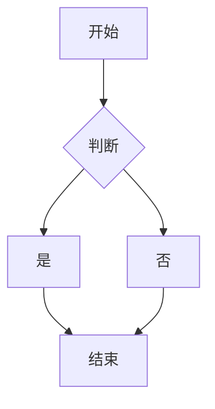
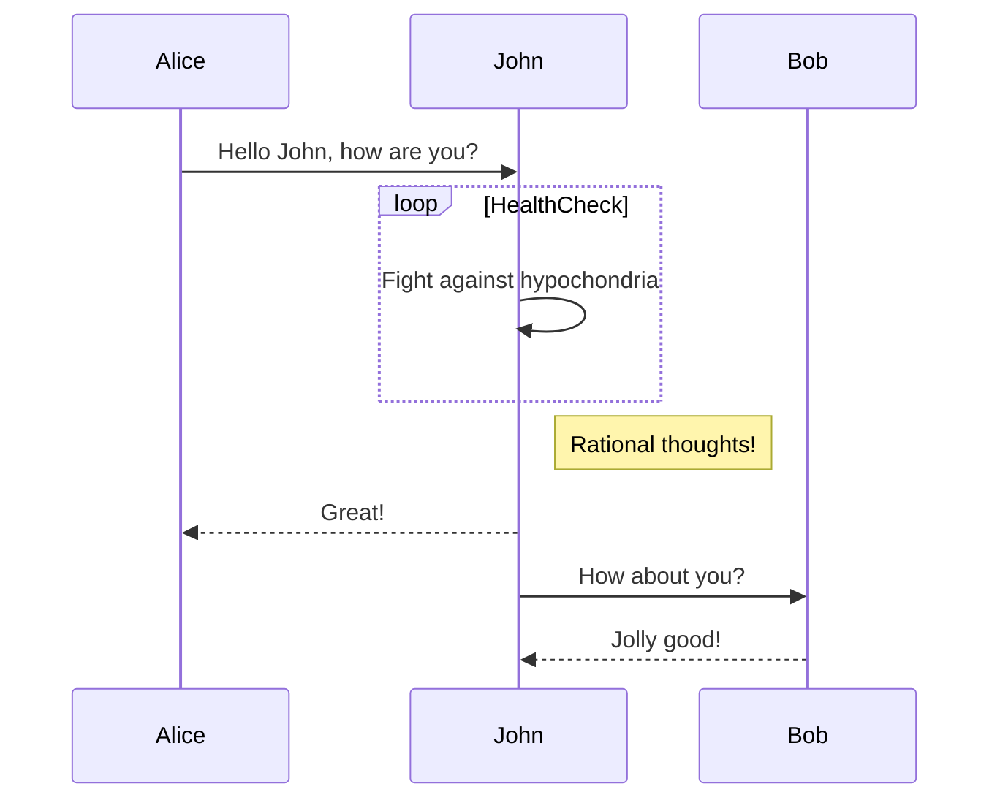

```html
<p class="jp" style="position: relative;">
 <ruby>
  プロジェクト
  <rt>
   ぷろじぇくと
  </rt>
 </ruby>
 <ruby>
  開始前
  <rt>
   かいしまえ
  </rt>
 </ruby>
 に
 <ruby>
  リスクアセスメント
  <rt>
   りすくあせすめんと
  </rt>
 </ruby>
 を
 <ruby>
  行い
  <rt>
   おこない
  </rt>
 </ruby>
 、
 <ruby>
  予測
  <rt>
   よそく
  </rt>
 </ruby>
 される
 <ruby>
  問題
  <rt>
   もんだい
  </rt>
 </ruby>
 に
 <ruby>
  対する
  <rt>
   たいする
  </rt>
 </ruby>
 <ruby>
  対応策
  <rt>
   たいおうさく
  </rt>
 </ruby>
 を
 <ruby>
  スケジュール
  <rt>
   すけじゅーる
  </rt>
 </ruby>
 に
 <ruby>
  組み込む
  <rt>
   くみこむ
  </rt>
 </ruby>
 こと。
 <ruby>
  定期的
  <rt>
   ていきてき
  </rt>
 </ruby>
 に
 <ruby>
  リスクレビュー
  <rt>
   りすくれびゅー
  </rt>
 </ruby>
 を
 <ruby>
  実施
  <rt>
   じっし
  </rt>
 </ruby>
 し、
 <ruby>
  スケジュール
  <rt>
   すけじゅーる
  </rt>
 </ruby>
 を
 <ruby>
  柔軟に
  <rt>
   じゅうなんに
  </rt>
 </ruby>
 <ruby>
  調整
  <rt>
   ちょうせい
  </rt>
 </ruby>
 する
 <ruby>
  仕組み
  <rt>
   しくみ
  </rt>
 </ruby>
 を
 <ruby>
  作る
  <rt>
   つくる
  </rt>
 </ruby>
 こと。
<span class="copy_btn">Copy</span></p>
```

```markmap
# 技术学习路线
## 前端开发
### 基础
- HTML/CSS
- JavaScript
### 框架
- React
- Vue
## 后端开发
### 语言选择
- Python
- Java
### 框架
- Django（Python）
- Spring Boot（Java）
## 工具与流程
### 版本控制
- Git
- GitHub
### 开发工具
- VS Code
- PyCharm
```


```echarts
{
  title: {
    text: '柱状图示例'
  },
  xAxis: {
    data: ['A', 'B', 'C', 'D', 'E']
  },
  yAxis: {},
  series: [{
    type: 'bar',
    data: [5, 20, 36, 10, 10]
  }]
}
```






**※** 以下の操作を行うときは、まずdockerをインストールしてください。

## 1. プロジェクトを起動する

 **※**：起動する前に実際状況に従って、`system_up.sh`の変数を更新してください。デフォルト設定をそのまま使うなら、`HOST`だけを更新すればいい。


#### ※ 異なる条件に応じてスクリプトを実行ください。

1) プロジェクトを初期化する場合、下記のコマンドを使用すればいい：
   **※** DB、フロントエンド、バックエンドなどリセットをしますので、注意して実行ください
   ```bash
   sudo sh system_init.sh
   ```

   Dockerイメージを構築する場合、下記のコマンドを使用してください
   ```bash
   sudo sh build.sh
   ```

2) バックエンドのみを再起動する場合は、下記のコマンドを使用してください：
   ```bash
   sudo sh system_up.sh
   ```

3) フロントエンドのみをビルドする場合、下記のコマンドを使用してください：
   ```javascript
   import hljs from 'highlight.js/lib/core';
   import xml from 'highlight.js/lib/languages/xml';
   hljs.registerLanguage('xml', xml);
 
 
   // 使用
   let code = ref('')
   // code 就是要显示的代码字符串
   const highlightedCode = hljs.highlight(code,
        { language: 'xml' }
     ).value;
   code.value = highlightedCode
   ```

4) データベースのみをリセットする場合、下記のコマンドを使用してください：
   ```bash
   sudo sh system_db.sh
   ```

## 2. ブラウザで下記ようなURLをアクセスする

   ```
   http://<HOST>:8080
   ```

- ユーザ名：admin
- パスワード：admin


# Windowsで開発環境構築

#### 動作環境
- OS：windows
- nodejs 最新版
ダウンロードサイト：https://nodejs.org/en
- python：3.12.8
ダウンロードサイト：https://www.python.org/downloads/release/python-3128/
- postgres:16.6
**※ データベースの構築は、UbuntuにDockerで構築するのを推奨する**

## 1. フロントエンドを構築
   1) フロントエンドのフォルダに切り替え  

   2) フロントエンドのフォルダでコマンドウィンドウを呼び出す
      

   3) 下記のコマンドを実行して環境の構築を開始する
      ```bash
      npm install
      ```
      

   4) 下記のコマンドを実行してフロントエンドを起動する
      ```
      npm run serve
      ```
      

## 2. データベースを構築
   1. データベース本体を構築
      **※** 「Docker環境構築」シートの１ー４）を参照ください。

   2. 環境変数を設定
      - WIN+Rを押すし、「cmd」ウィンドウを呼び出す
         

      - 下記のコマンドで実行して環境変数設定ウィンドウを呼び出す
         ```bash
         rundll32 sysdm.cpl,EditEnvironmentVariables
         ```
         

      - system_up.shの中の変数にに従って、環境変数を追加して保存する
         **※** デフォルト設定をそのまま使うなら、「HOST」だけを設定すればいい。
         例：
         


## 3. バックエンドを構築
   1. ルートフォルダに切り替える

   2. フロントエンドのフォルダでコマンドウィンドウを呼び出す
      

   3. 下記のコマンドを実行してpythonの環境構築を開始する
   **※** 本番の場合、研究所側必要なライブラリは「requirements.txt」に先に追加してください。
      ```bash
      pip install -r requirements.txt
      ```

   4. 下記のコマンドを実行してバックエンドを起動する
      ```bash
      python app.py --port=8888
      ```

   5. ブラウザから下記のURLをアクセスする
      ```bash
      http://127.0.0.1:8888
      ```
      